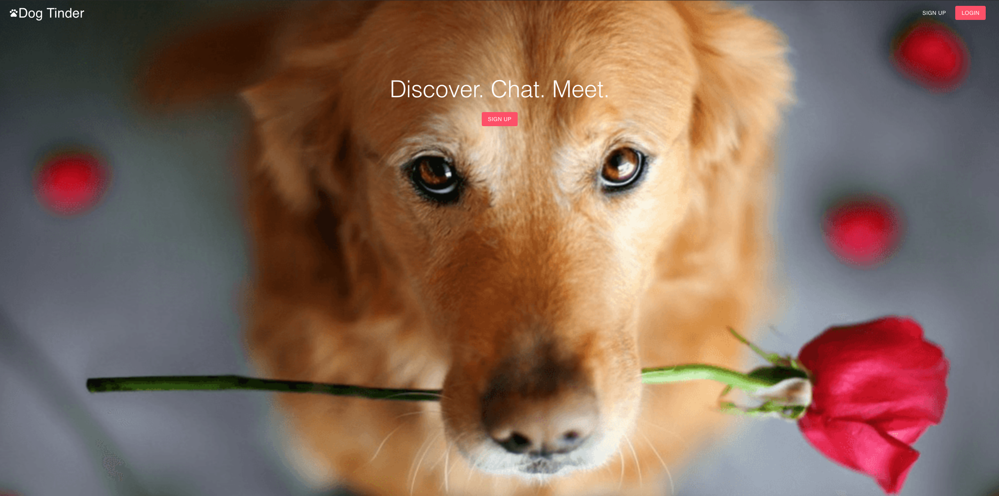

# Dog Tinder

### Tech

#### Backend: Apollo-graphql, express, PostgreSQL, sequelize

#### Frontend: React, apollo-react, graphQL, materialize-ui, react-router-dom, react-context

## Links

- [Wireframe](https://wireframepro.mockflow.com/view/M63e650c9df5cc289f34b4b6c30ed1df61598867540247#/page/0766497b5bf94ed2827e6cd60fa0ea31)
- [Kanban task board](https://github.com/weilonglin/portfolio-project-frontend/projects/1)
- [DB Diagram](https://dbdiagram.io/d/5f4e166088d052352cb589ce)

## User stories

As a user, I would like to signup and make a profile

As a user, I want to add my dogs to my profile, to find a dog date

As a user, I want to browse through a feed of other dog profiles, to find the perfect match for my dog

As a user, I want to “like” a dog profile, so that the other dog owner gets notified on our intrest

As a user, I want to know when another user has “liked” my dog’s profile, so we can chat and possible arrange a walk

As a user, I want to “dislike” a profile that is in no way a match, by disliking, the app shouldn’t show me that profile again

As a user, I want targeted profiles served on the feed, so the best matches show up

As a user, I want to filter through profiles, to find the best matches.

## DB relations

Users hasMany dogs

Dogs belongsTo Users

Dogs belongsToMany tags

Tags belongsToMany dogs

chatMessages belongsTo users

chatMessages belongsTo recipient

Dogs hasMany joinedTableLikes

JoinedTableLikes belongsTo users

Dogs hasMany joinedTabledislikes

joinedTabledislikes belongsTo users
